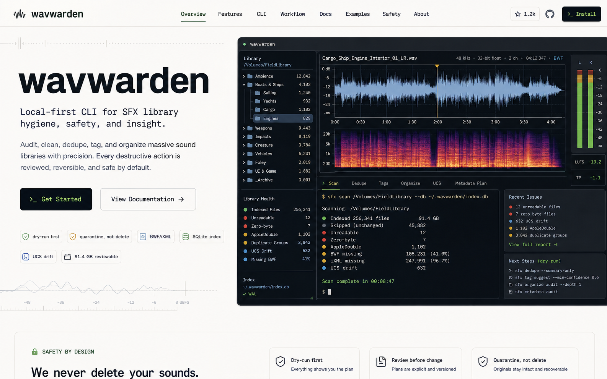

# wavwarden App UI Direction

This note preserves the first visual direction mockup for wavwarden's eventual app surface.

## Intent

The website can be expressive, but the app itself should feel like a careful audio-maintenance workbench:

- Dense, keyboard-friendly, and built for repeated review work.
- Audio-centric without becoming decorative: waveform strips, spectrogram hints, channel meters, file trees, and scan status indicators.
- Explicit about safety state: dry-run, review, quarantine, undo, validation, and readback.
- Calm enough for long sessions, with signal colors used consistently.

## Visual Language To Carry Forward

- Graphite inspection panels on an off-white workspace.
- Calibrated green for safe/accepted states.
- Muted signal blue for indexed or informational states.
- Amber for review/warning states.
- Small red markers for errors or destructive-risk attention.
- Practical technical labels such as `BWF/iXML`, `SQLite index`, `UCS drift`, `dry-run first`, and `quarantine, not delete`.

## Likely App Surfaces

- Scan dashboard
- Searchable file table
- Filename and metadata issue queues
- Duplicate and pack-overlap review
- Similarity group review
- Tag and metadata write planning
- Apply/undo logs
- Command and validation history

The mockup is a visual reference, not a literal app specification. The production app should prioritize clarity, speed, and predictable review flows over homepage drama.
